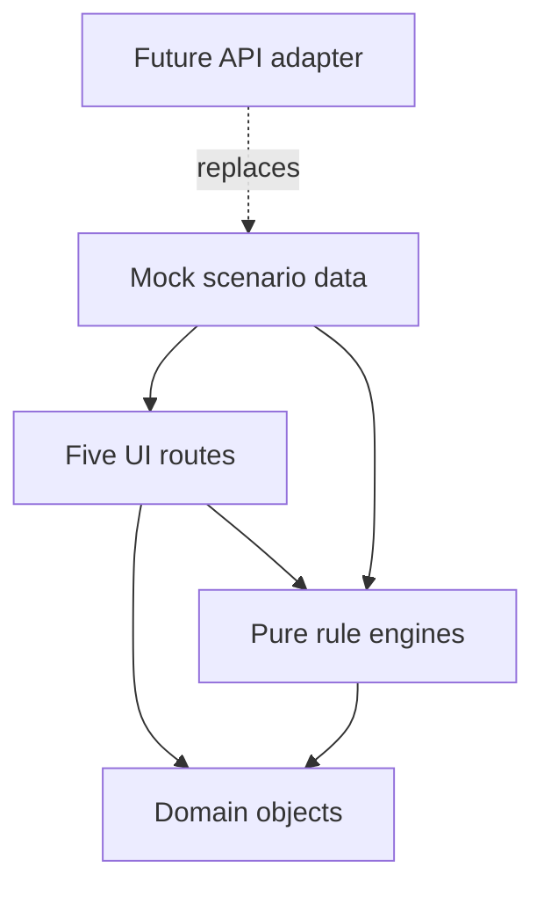

# Architecture

## Boundary

This repository is a Concept Demo with durable rule boundaries, not a miniature production system.

## Responsibilities

- **UI** renders results and captures intent. It may orchestrate a demo sequence but performs no ranking or default arithmetic.
- **Domain** names shared product concepts and states.
- **Engines** own challenge transitions, discovery eligibility, leaderboard ordering, default liability, and cleansing.
- **Mock** supplies deterministic people, pacts, stakes, and a repeatable story.

## Two-repository replacement path

1. Keep the public Concept Demo deterministic and independently runnable.
2. Define a public repository or event interface returning domain objects.
3. Implement authoritative identity, trust, ranking, and operations in the private production repository.
4. Replace local demo persistence with an adapter to that interface when the production boundary is ready.
5. Keep public product rules inspectable while keeping private data, thresholds, enforcement, and credentials out of this repository.

No UI route should need a conceptual rewrite during this migration.

See [Open-core boundary](OPEN_CORE_BOUNDARY.md) for the placement rule that
applies before future work begins.
