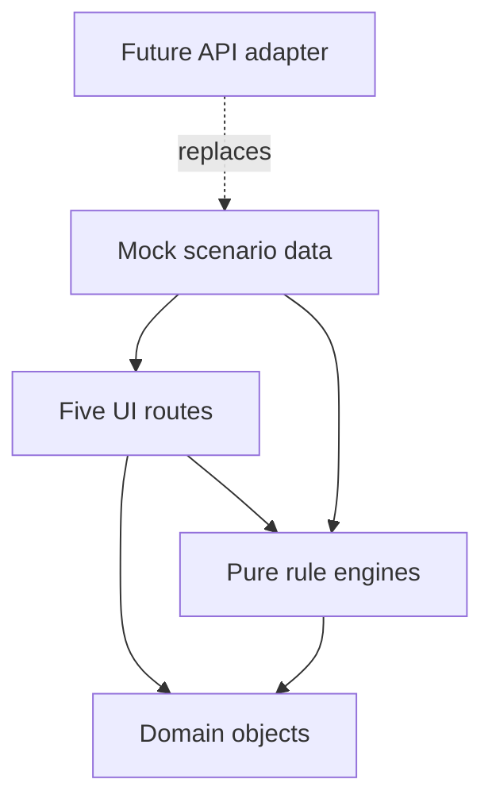

# Architecture

## Boundary

This repository is a Concept Demo with durable rule boundaries, not a miniature production system.

## Responsibilities

- **UI** renders results and captures intent. It may orchestrate a demo sequence but performs no ranking or default arithmetic.
- **Domain** names shared product concepts and states.
- **Engines** own challenge transitions, discovery eligibility, leaderboard ordering, default liability, and cleansing.
- **Mock** supplies deterministic people, pacts, stakes, and a repeatable story.

## Backend replacement path

1. Add a repository interface returning domain objects.
2. Keep engines pure; run them server-side where authority matters.
3. Replace local demo persistence with an API adapter.
4. Add event IDs and optimistic concurrency around state transitions.
5. Add identity, proof, dispute, and logistics boundaries only after their product rules are accepted.

No UI route should need a conceptual rewrite during this migration.
