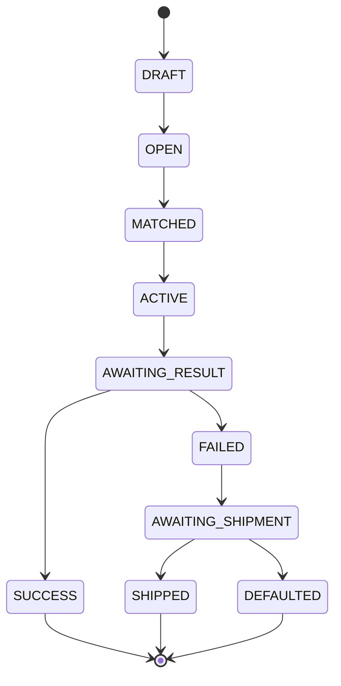

# Challenge State Machine



The transition table in `engine/challengeStateMachine.ts` is the source of truth. Invalid transitions throw; the interface advances only through engine calls.

Leaderboards never appear in this graph. They are a discoverability concern, calculated from challenge metrics and creator eligibility.

## Demo path

```text
OPEN → MATCHED → ACTIVE → AWAITING_RESULT
     → FAILED → AWAITING_SHIPMENT → DEFAULTED
```

The shipped branch is interactive so reviewers can compare outcomes, but the default branch carries the main V0 story.
